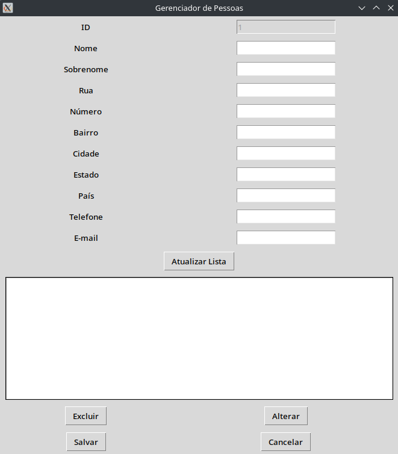

# Cadastro de Pessoas em Python com Tkinter

## Descrição

Este projeto é um gerenciador de **cadastro de pessoas** feito em Python, utilizando a biblioteca Tkinter para a interface gráfica e CSV para o armazenamento de dados. A aplicação permite cadastrar, alterar, excluir e listar pessoas, com informações como nome, endereço, telefone e e-mail. A interface permite a interação com o usuário de forma intuitiva, proporcionando um controle completo sobre os dados.

## Técnologias Utilizadas

- **Python**: Linguagem de programação usada para a lógica da aplicação.
- **Tkinter**: Biblioteca gráfica padrão do Python para criar interfaces de usuário.
- **CSV**: Formato de arquivo utilizado para armazenar os dados de cadastro.

## Funcionalidades

- **Cadastrar Pessoas**: Permite ao usuário adicionar novas pessoas ao sistema, com campos como nome, sobrenome, endereço, telefone e e-mail.
- **Alterar Cadastro**: Permite alterar informações de um cadastro existente.
- **Excluir Cadastro**: Permite excluir cadastros da lista.
- **Listar Pessoas**: Exibe todos os cadastros na interface, com a possibilidade de selecionar e modificar ou excluir.
- **Validação de Dados**: Realiza validação básica de dados, como verificar se o telefone e e-mail são válidos.
- **Armazenamento em CSV**: Todos os dados são salvos em um arquivo CSV, garantindo persistência dos registros.

## Como Executar

Para executar o projeto, siga as etapas abaixo:

- **Clone o Repositório**: Clone o repositório para o seu computador utilizando o Git. No terminal, execute o seguinte comando:

```
git clone https://github.com/seu-usuario/Cadastro-Pessoas.git
```

- **Instale o Tkinter**: O Tkinter geralmente já vem instalado com o Python. Caso não tenha o Tkinter, instale-o utilizando o seguinte comando:

```
pip install tk
```

- **Execute o Programa**: Após clonar o repositório e garantir que o Tkinter esteja instalado, navegue até o diretório onde o repositório foi clonado e execute o seguinte comando para iniciar o aplicativo:

```
python main.py
```

A janela da aplicação será aberta e você poderá começar a adicionar, alterar ou excluir cadastros.

## Como Funciona

- **Cadastro de Pessoas**: Você pode adicionar um novo cadastro preenchendo os campos de nome, sobrenome, endereço, telefone, e-mail, entre outros.
- **Alterar Cadastro**: Selecione uma pessoa da lista e altere suas informações.
- **Excluir Cadastro**: Selecione um cadastro e exclua-o do sistema.
- **Listagem de Pessoas**: Todos os cadastros serão exibidos em uma lista para fácil visualização e edição.

## Layout da Tela



## Contribuições

**Se você quiser contribuir para este projeto, fique à vontade para abrir issues ou enviar pull requests. Toda contribuição sempre será bem-vinda!**

## Licença

Este projeto está licenciado sob a [Licença MIT](LICENSE.txt).